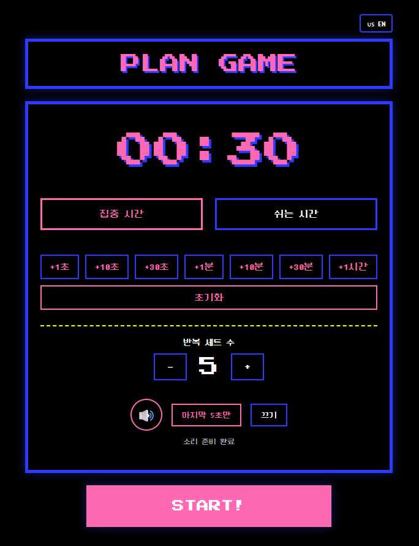

# App 01. 운동 타이머

## 한 줄 소개

운동 시간과 쉬는 시간을 세트 단위로 반복할 수 있는 레트로 게임 스타일 인터벌 타이머입니다.

## 배포 링크

[https://app-01-focus-together.pages.dev](https://app-01-focus-together.pages.dev)

## 화면 미리보기

## 현재 컨셉

초기에는 ADHD 사용자를 위한 소셜 집중 타이머로 시작했지만, 현재 공개 버전은 운동 루틴에 바로 쓸 수 있는 타이머로 방향을 정리했습니다.

핵심 사용 장면은 다음과 같습니다.

- 홈트레이닝 인터벌
- 스트레칭 루틴
- 플랭크/스쿼트/복근 운동 세트
- 운동 시간과 휴식 시간을 반복하는 간단한 루틴

## 핵심 기능

- 운동 시간 / 쉬는 시간 선택
- 빠른 시간 추가 버튼
- 반복 세트 수 설정
- 자동 단계 전환
- 소리 모드 선택
  - 마지막 5초만
  - 매초마다
  - 끄기
- 모바일 소리 재생 fallback
- 화면 꺼짐 방지용 Screen Wake Lock
- 모바일 화면에서 긴 타이머가 넘치지 않도록 반응형 보정

## 포트폴리오 포인트

이 프로젝트는 단순한 타이머 구현보다, 실제 모바일 사용 과정에서 발견되는 문제를 해결한 기록에 의미가 있습니다.

- 모바일 브라우저의 오디오 정책 대응
- 화면 꺼짐 방지 기능 적용
- 배포 후 실제 기기 피드백 기반 수정
- 컨셉 변경을 README와 문서에 반영하는 포트폴리오 정리

## 배운 점

1. 컨셉은 구현 과정에서 더 적합한 방향으로 바뀔 수 있습니다.
2. 모바일에서는 소리, 화면 꺼짐, 가로폭 같은 실제 사용 문제가 데스크톱보다 더 중요합니다.
3. 배포 후 피드백을 반영하는 과정이 앱을 “작동하는 결과물”로 만듭니다.
4. 포트폴리오용 앱은 기능뿐 아니라 의도, 변화 과정, 배운 점을 함께 보여줘야 합니다.
